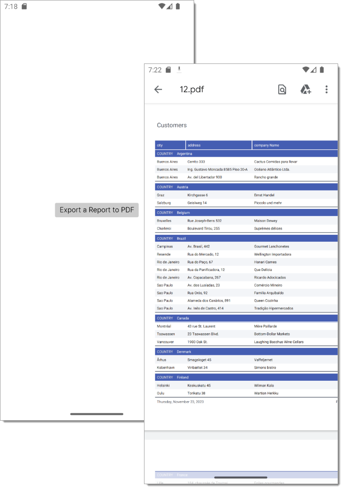

<!-- default badges list -->

<!-- default badges end -->
# Reporting for Avalonia - Get Started

This example shows how to load a report from a file, configure the report to retrieve JSON data from a specified URL, and export the report to PDF.

## Implementation

The previously created report that uses JSON data from the https://northwind.netcore.io/customers.json location  is saved to a report layout file (*.repx).
If you are using VSCode Avalonia Extension to develop Avalonia-based apps, you can also install the [DevExpress Report Designer VSCode Extension](https://community.devexpress.com/blogs/reporting/archive/2023/10/30/reporting-create-and-modify-devexpress-reports-in-vscode-on-macos-and-linux-ctp.aspx) to run the Report Wizard that enables you to create, edit, and save a report.

The report created earlier using JSON data from https://northwind.netcore.io/customers.json is saved to a report layout file (.repx ). If you're using the VSCode Avalonia Extension to develop Avalonia-based applications, consider installing the [DevExpress Report Designer VSCode Extension](https://community.devexpress.com/blogs/reporting/archive/2023/10/30/reporting-create-and-modify-devexpress-reports-in-vscode-on-macos-and-linux-ctp.aspx). This extension allows you to run the Report Wizard and makes it easier to create, edit and save reports.

To open a report layout file (*.repx) at runtime, add it to the Avalonia `Assets` folder in the project.

Register a custom `IJsonSourceCustomizationService` service for the report instance to fetch JSON data dynamically. For Avalonia browser project, ensure to execute our native `JsonLoaderHelper.ConfigureHttpClient` and `JsonLoaderHelper.ConfigureHttpRequestMessage` methods at startup to pass credentials in the JSON data request.

## Files to Review

- [MainView.axaml](AvaloniaApplication1/AvaloniaApplication1/Views/MainView.axaml)
- [MainView.axaml.cs](AvaloniaApplication1/AvaloniaApplication1/Views/MainView.axaml.cs)
- [AvaloniaApplication1.Browser/Program.cs](AvaloniaApplication1/AvaloniaApplication1.Browser/Program.cs)

## Documentation

- [Reporting — Create and Modify DevExpress Reports in Visual Studio Code (VS Code) on macOS and Linux (CTP)](https://community.devexpress.com/blogs/reporting/archive/2023/10/30/reporting-create-and-modify-devexpress-reports-in-vscode-on-macos-and-linux-ctp.aspx)
- [Create a Report in Visual Studio](https://docs.devexpress.com/XtraReports/14989/get-started-with-devexpress-reporting/create-a-report-in-visual-studio)
- [Bind Reports to Data](https://docs.devexpress.com/XtraReports/15034/detailed-guide-to-devexpress-reporting/bind-reports-to-data)
- [Export Reports](https://docs.devexpress.com/XtraReports/1302/detailed-guide-to-devexpress-reporting/store-and-distribute-reports/export-reports)
- [Use Reporting on Linux and macOS](https://docs.devexpress.com/XtraReports/404221/dot-net-and-net-core-support/use-reporting-on-linux)

## More Examples

- [Reporting for ASP.NET Core - How to Use the SkiaSharp-Based DevExpress Drawing Engine](https://github.com/DevExpress-Examples/reporting-use-devexpress-drawing-skia-engine)
<!-- feedback -->
## Does this example address your development requirements/objectives?

 

(you will be redirected to DevExpress.com to submit your response)
<!-- feedback end -->
